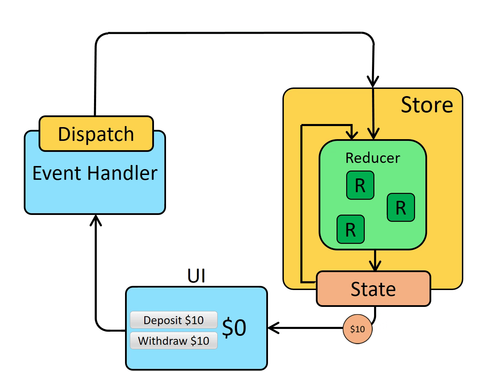

<!--
 * @author: ilove523 <wush3w@126.com>
 * @Date: 2020-12-17 09:26:29
 * @LastEditTime: 2020-12-17 17:21:04
 * @LastEditors: ilove523
 * @description: ''
-->

## graphql-tag

```sh
yarn add graphql-tag
```

## for express-graphql
```sh
yarn add express express-graphql graphql
```

> https://redux.js.org/tutorials/essentials/part-1-overview-concepts
